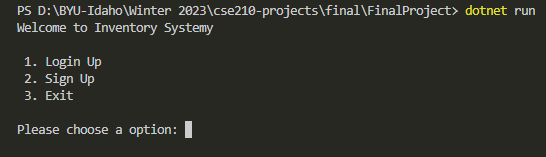
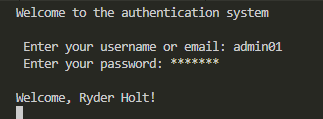
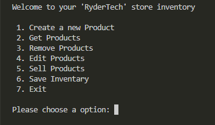

# Inventory System Management

## About
The system will allow the store to manage its inventory efficiently by providing functionalities such as adding, editing and deleting products in real time. The system will be built using the principles of object-oriented programming, including abstraction, encapsulation, inheritance, and polymorphism. It will be designed to be modular, scalable and easy to maintain. It will also have a small database where the owner can keep all the information of his inventory, it will also have a login so that there is security that only authorized people use the inventory management system.

The system will help streamline inventory management and minimize the risk of stock-outs. Ultimately, this project aims to provide store owners with an intuitive, reliable and efficient tool to manage their inventory, allowing them to focus on growing their business and maximizing their profits.

## Features

## Screenshots

## Getting Started
Instructions on how to download, install, and run the application.

## Usage
How to use the application.

## Technologies
***
A list of libraries used within the project:
* [ConsoleTableExt](ConsoleTableExt): Version 3.2 
* [Newtonsoft.Json](Newtonsoft.Json): Version 13.0.3
* [ConsoleTables](ConsoleTables): Version 2.4.2

## Contributing
Instructions on how to contribute to the project.

